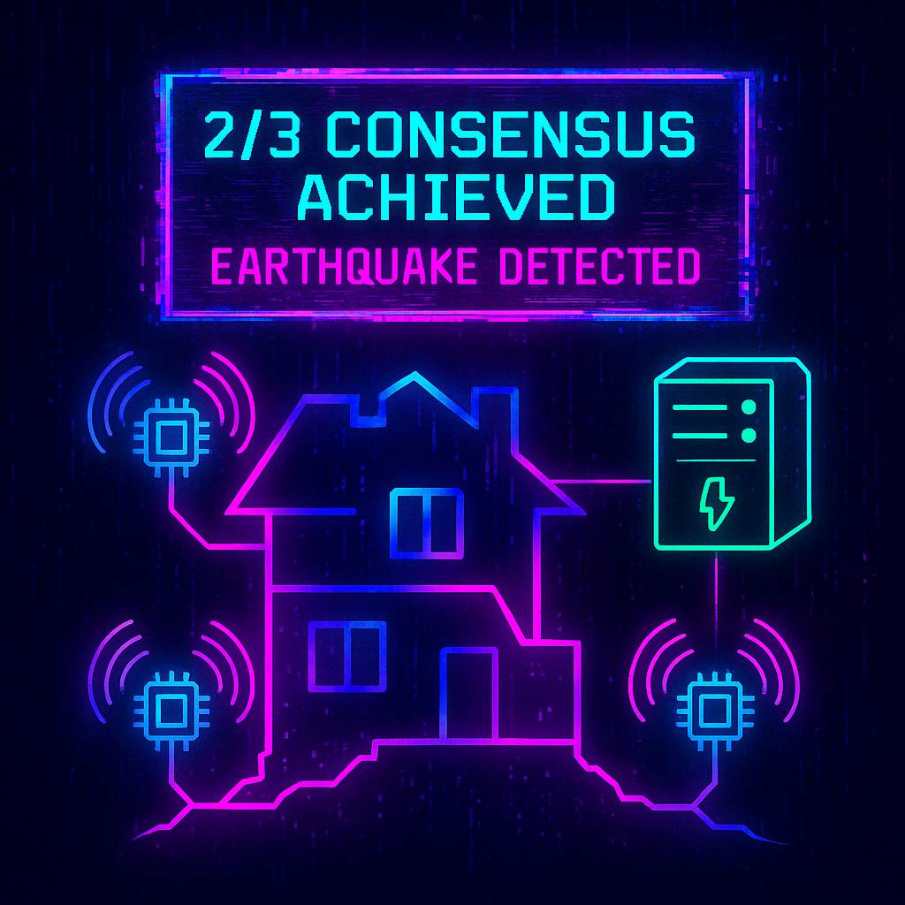
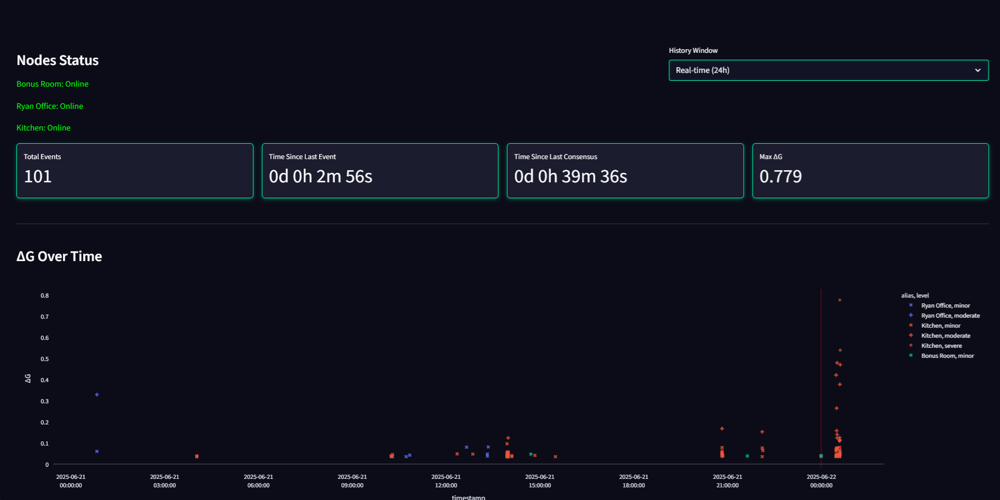

# ESP8266 MPU6050 Seismometer





**🌟 Full-Stack Cyberpunk Seismometer:** NodeMCU (ESP8266) + MPU6050 with Flask API and a stunning Streamlit dashboard.

**💡 Why This Project?**
- Beginner-friendly end-to-end guide in VS Code.
- Real-time & historical ΔG charts with consensus detection.
- Automated dashboard launch in Microsoft Edge full-screen.

**🚀 Get Started in Minutes:**
1. **Clone Repo**: `git clone https://github.com/yourusername/ESP8266_MPU6050_Seismometer.git`
2. **Install Prerequisites** (see below).
3. **Build & Flash** the ESP8266 sketch via PlatformIO.
4. **Run Server & Dashboard**: `server\startup.bat`.
5. **View Dashboard** at `http://localhost:8501` in Edge.

⭐️ **If you find this project useful, please give it a star and follow for more!** ⭐️

---

## Table of Contents

1. [Prerequisites](#prerequisites)
2. [Wiring Diagram](#wiring-diagram)
3. [Repository Overview](#repository-overview)
4. [Setting Up Visual Studio Code](#setting-up-visual-studio-code)
5. [Configuring the Arduino/ESP8266 Environment](#configuring-the-arduinoesp8266-environment)
6. [Client Sketch (ESP8266 MPU6050 Code)](#client-sketch-esp8266-mpu6050-code)
7. [Server & Dashboard (Flask API + Streamlit UI)](#server--dashboard-flask-api--streamlit-ui)
8. [🚀 Launch Dashboard](#launch-dashboard)
9. [Dashboard UI Features](#dashboard-ui-features)
10. [Working with the Serial Monitor](#working-with-the-serial-monitor)
11. [Debugging and Deployment](#debugging-and-deployment)
12. [Troubleshooting Common Issues](#troubleshooting-common-issues)
13. [License](#license)

---

## Prerequisites

- **Visual Studio Code** installed on your system  
- **Python 3.7+** (for Flask server)  
- **NodeMCU (ESP8266)** board & **MPU6050** sensor module  
- **USB cable** for flashing ESP8266

---

## Wiring Diagram

Connect the NodeMCU pins to the MPU6050 as follows:

| NodeMCU Pin    | MPU6050 Pin | Description            |
| -------------- | ----------- | ---------------------- |
| 3V3            | VCC         | 3.3V Power             |
| GND            | GND         | Ground                 |
| D2 (GPIO4)     | SDA         | I2C Data Line          |
| D1 (GPIO5)     | SCL         | I2C Clock Line         |
|                |             |                        |
| **Wiring Note:** Use 4.7kΩ pull-up resistors on SDA/SCL if your breakout board does not include them.

---

## Architecture Diagram

Below is a high-level flow of how the ESP8266 client, Flask server, and Streamlit dashboard interact:

```mermaid
flowchart LR
    subgraph Client [ESP8266 Client]
        A1[Read MPU6050] --> A2[Detect ΔG Event]
        A2 --> A3[POST /api/seismic]
        A2 --> A4[Heartbeat: GET /?id=MAC]
    end

    subgraph Server [Flask API]
        B1[/api/seismic] --> B2[Log Event to file]
        B3[/] --> B4[Update Heartbeat Status]
        B2 --> B5[Window Timer → Consensus]
        B2 --> B6[Append events.txt]
    end

    subgraph Dashboard [Streamlit UI]
        C1[Fetch status, events, http_logs] --> C2[Process & Filter Data]
        C2 --> C3[Render Charts & Tables]
    end

    A3 --> B1
    A4 --> B3
    B2 --> C1
```

---

## Repository Overview

```
ESP8266_MPU6050_Seismometer/
├── lib/                        # Third-party Arduino libraries
├── src/                        # Client .cpp sketch
│   └── ESP8266_MPU6050_Seismometer.cpp
├── server/                     # Flask server files
│   ├── .env
│   ├── install.bat
│   ├── requirements.txt
│   ├── server.py
│   └── startup.bat
├── platformio.ini              # PlatformIO project config
├── .gitignore
└── LICENSE
```

---

## Setting Up Visual Studio Code

### Installing VS Code

1. Download the installer from [Visual Studio Code](https://code.visualstudio.com/) and follow the standard installation process.  
2. Launch VS Code once installed.

### Essential Extensions

Install these from the Extensions view (`Ctrl+Shift+X`):

- **PlatformIO IDE** for embedded development with ESP8266 citeturn2search0  
- **C/C++ Extension Pack** for IntelliSense and debugging citeturn2search8  
- **Python (ms-python.python)** for Flask and scripting citeturn3search1  

### Configuring Settings

1. Open **Settings** (`Ctrl+,`).  
2. Enable **PlatformIO › IDE: Toolbar** to see Build/Upload icons.  
3. Set `python.pythonPath` to your interpreter (e.g., `${workspaceFolder}/.venv/bin/python`).  

---

## Configuring the Arduino/ESP8266 Environment

### PlatformIO Project Setup

1. Verify `platformio.ini` is present at the root.  
2. Open the folder in VS Code—look for the PlatformIO alien-head icon.  
3. Use **PlatformIO: Build** (checkmark) to compile, and **PlatformIO: Upload** (arrow) to flash citeturn2search1turn2search2.

### platformio.ini Explained

```ini
[platformio]
default_envs = nodemcuv2

[env:nodemcuv2]
platform      = espressif8266
board         = nodemcuv2
framework     = arduino
monitor_speed = 115200
lib_deps =
  jrowberg/I2Cdev @ ^1.1.0
  adafruit/MPU6050 @ ^1.4.3
```

- `default_envs` sets the environment for builds.  
- `board` and `platform` define toolchains for NodeMCU citeturn2search7.  
- `lib_deps` auto-downloads I2Cdev and MPU6050 libraries.

### Managing Libraries

- Place local libraries in `lib/`, or use `lib_deps` in `platformio.ini`.  
- After editing `platformio.ini`, PlatformIO fetches/update dependencies automatically when building.

---

## Client Sketch (ESP8266 MPU6050 Code)

See `src/ESP8266_MPU6050_Seismometer.cpp` for:

1. **Wi-Fi Connection** & MAC ID report  
2. **MPU6050 Initialization** & calibration  
3. **Event Detection** (`minor`, `moderate`, `severe`)  
4. **Health Check** every 60s with HTTP GET to `ROOT_URL?id=<MAC>`  
5. **JSON POST** of events to server endpoint  

---

## Server & Dashboard (Flask API + Streamlit UI)

- **Flask API** (port 3000): serves endpoints for status, events, and HTTP logs.
- **Streamlit Dashboard** (port 8501): visualizes real-time sensor data and system metrics.

### Flask API Endpoints

| Endpoint               | Method | Description                                      |
| ---------------------- | ------ | ------------------------------------------------ |
| `/api/status`          | GET    | Returns online/offline status of each node       |
| `/api/events`          | GET    | Returns raw ΔG events and confirmed consensus    |
| `/api/http_logs`       | GET    | Returns recent API call logs timestamped by endpoint |
| `/`                    | GET    | Heartbeat endpoint for clients (with `?id=<MAC>`) |

### Streamlit Dashboard

- **Auto-refresh** every 60 s to pull new data.
- **History Window Selector:** choose Real-time (24 h), 7 d, 15 d, 30 d.
- **Full-screen Launch:** automated via `startup.bat` in Edge kiosk mode.

---

## 🚀 Launch Dashboard

- Run `server\startup.bat` to start both Flask and Streamlit servers.
- Access the dashboard at `http://localhost:8501` in Microsoft Edge.

---

## Dashboard UI Features

- **Node Status Chips:** horizontally aligned indicators with neon-green/red glass panels.
- **Key Metrics Cards:** Total Events, Time Since Last Event (D/H/M/S), Time Since Last Consensus, Max ΔG.
- **History Selector:** select time window to filter all charts and tables.
- **ΔG Scatter Chart:** individual markers by event, custom symbols for `minor`, `moderate`, `severe`, transparent background, vertical red lines marking consensus windows.
- **Consensus Events Table:** grouped rows of all node readings within each 2 s consensus window, showing Timestamp, Alias, ΔG, and Severity.
- **HTTP Traffic Chart:** full-width area chart resampled per minute by endpoint, transparent, no borders.
- **Recent ΔG Reports:** table of latest ΔG events with minutes since occurrence.
- **Cyberpunk Theme:** glassmorphism panels, neon Orbitron fonts, animated backdrop, pixel-perfect spacing, no default Streamlit chrome.

---

## Working with the Serial Monitor

- **PlatformIO Monitor**: click the plug icon or run `PlatformIO: Monitor`. citeturn2search3  
- Serial output shows real-time accelerometer Y,Z and boot/health messages.

---

## Debugging and Deployment

- Set breakpoints in `server.py` and press **F5** to run Flask in debug mode.  
- Use **Debug Console** to inspect variables during runtime.  

---

## Troubleshooting Common Issues

- **COM Port Access Denied:** close other serial monitors or run VS Code as Administrator.  
- **Long Path Errors:** move project to a shorter path (e.g., `C:\Projects\ESPSeismo`) or enable Windows long paths via Group Policy citeturn3search10.  

---

## License

This project is licensed under the Apache-2.0 License.
